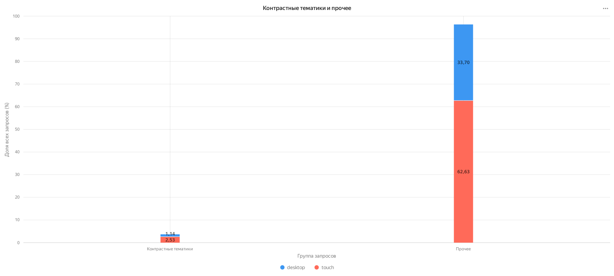

# Анализ поиска в Яндекс.Картинках

## Данные и метод 

Данные охватывают период с 1 сентября 2021 года 00:00:00 до 21 сентября 2021 года 23:59:59 по московскому времени.

### SQL-запрос

```sql
SELECT
    MIN(event_at) AS first_event_at,
    MAX(event_at) AS last_event_at,
    COUNT(*) AS events_count
FROM search_events;
```

## Запрос «ютуб» по платформам 

1. В абсолютных значениях разница по количеству запросов небольшая: 806 на desktop и 732 на touch.
2. При учете разного объема трафика значение стат. значимо: Доля запроса "ютуб" составляет 0,208% на desktop и 0,101% на touch.
3. Платформа touch проигрывает по объему запросов платформе desktop, скорее всего, в связи с альтернативным путем достижения цели - прямым переходом через приложение.

### SQL-запросы

Общий объём поисковых событий по платформам:

```sql
SELECT
    pl.platform_name,
    COUNT(*) AS events_count
FROM search_events AS ev
JOIN platforms AS pl ON pl.platform_id = ev.platform_id
GROUP BY pl.platform_name
ORDER BY events_count DESC;
```

Количество запросов, содержащих «ютуб»:

```sql
SELECT
    pl.platform_name,
    COUNT(*) AS youtube_queries
FROM search_events AS ev
JOIN search_queries AS qu ON qu.query_id = ev.query_id
JOIN platforms AS pl ON pl.platform_id = ev.platform_id
WHERE LOWER(qu.query_text) LIKE '%ютуб%'
GROUP BY pl.platform_name
ORDER BY youtube_queries DESC;
```


[Открыть интерактивный график в DataLens](https://datalens.yandex/phuqunclc9xc8)

## Топ-10 запросов 

1. На desktop в топе преимущественно находятся справочные и учебные запросы «календарь 2021», «таблица менделеева», «английский алфавит» и «таблица квадратов».
2. На touch в топе поздравления, погода, игры, фильмы, музыка и новости.
3. График указывает на разный контекст использования: Desktop чаще задействован для целенаправленного поиска и наиболее подходит для представления пользователю расширенных ответов при запросе, touch чаще используется для быстрых повседневных задач.

### SQL-запрос

```sql
WITH ranked AS (
    SELECT
        pl.platform_name,
        qu.query_text,
        COUNT(*) AS queries_count,
        ROW_NUMBER() OVER (
            PARTITION BY pl.platform_name
            ORDER BY COUNT(*) DESC, qu.query_text
        ) AS rank_in_platform
    FROM search_events AS ev
    JOIN search_queries AS qu ON qu.query_id = ev.query_id
    JOIN platforms AS pl ON pl.platform_id = ev.platform_id
    GROUP BY pl.platform_name, qu.query_text
), ranked_top AS (
    SELECT
        platform_name,
        rank_in_platform,
        query_text,
        queries_count,
        ROW_NUMBER() OVER (
            ORDER BY queries_count ASC, platform_name, query_text
        ) AS sort_order_asc
    FROM ranked
    WHERE rank_in_platform <= 10
)
SELECT
    platform_name,
    rank_in_platform,
    query_text,
    queries_count,
    sort_order_asc
FROM ranked_top
ORDER BY sort_order_asc;
```


[Открыть интерактивный график в DataLens](https://datalens.yandex/yq310ppjnnomh)

## Распределение запросов по часам 

1. Touch преобладает по количеству запросов над desktop на протяжении всего дня.
2. На desktop активность сильнее сосредоточена в дневные часы и достигает пика в 16:00.
3. На touch активность сосредотачивается в двух периодах: утреннем с 7:00 до 10:00 и вечернем с 19:00 до 21:00, пик наблюдается в 20:00.
4. Desktop чаще используется днём для работы или учёбы, в то время как touch больше участвует в повседневных задачах утром и вечером.

### SQL-запрос

```sql
WITH hourly AS (
    SELECT
        pl.platform_name,
        EXTRACT(HOUR FROM ev.event_at AT TIME ZONE 'Europe/Moscow')::int AS hour_of_day,
        COUNT(*) AS queries_count
    FROM search_events AS ev
    JOIN platforms AS pl ON pl.platform_id = ev.platform_id
    GROUP BY pl.platform_name, hour_of_day
)
SELECT
    platform_name,
    hour_of_day,
    queries_count,
    ROUND(
        100.0 * queries_count / SUM(queries_count) OVER (PARTITION BY platform_name),
        2
    ) AS queries_share_pct
FROM hourly
ORDER BY platform_name, hour_of_day;
```


[Открыть интерактивный график в DataLens](https://datalens.yandex/jbomzhliz7us2)

## Контрастные тематики

1. На touch выше доля запросов про «кино и сериалы» и «дом и интерьер», это 1,31% против 0,67% и 0,69% против 0,38% на desktop - мобильный поиск чаще используют для досуга и повседневных задач.
2. На desktop выше доля запросов про учёбу, она составляет 0,96% против 0,55% на touch, это соответствует гипотезе про более подробный поиск информации при использовании desktop.
3. По запросам про животных заметной разницы между платформами нет.

### SQL-запрос

```sql
WITH themed_events AS (
    SELECT
        pl.platform_name,
        CASE
            WHEN LOWER(qu.query_text) ~ '(фильм|сериал|кино)' THEN 'кино и сериалы'
            WHEN LOWER(qu.query_text) ~ '(собака|кот|кошка|животн)' THEN 'животные'
            WHEN LOWER(qu.query_text) ~ '(диван|кухн|интерьер|дизайн)' THEN 'дом и интерьер'
            WHEN LOWER(qu.query_text) ~ '(школ|урок|учеб)' THEN 'учёба'
            ELSE 'прочее'
        END AS topic
    FROM search_events AS ev
    JOIN search_queries AS qu ON qu.query_id = ev.query_id
    JOIN platforms AS pl ON pl.platform_id = ev.platform_id
), topic_shares AS (
    SELECT
        platform_name,
        topic,
        COUNT(*) AS queries_count,
        100.0 * COUNT(*) / SUM(COUNT(*)) OVER (PARTITION BY platform_name) AS share_pct
    FROM themed_events
    GROUP BY platform_name, topic
)
SELECT
    topic,
    MAX(queries_count) FILTER (WHERE platform_name = 'desktop') AS desktop_queries,
    MAX(queries_count) FILTER (WHERE platform_name = 'touch') AS touch_queries,
    ROUND(MAX(share_pct) FILTER (WHERE platform_name = 'desktop'), 2) AS desktop_share_pct,
    ROUND(MAX(share_pct) FILTER (WHERE platform_name = 'touch'), 2) AS touch_share_pct,
    ROUND(
        MAX(share_pct) FILTER (WHERE platform_name = 'touch')
        - MAX(share_pct) FILTER (WHERE platform_name = 'desktop'),
        2
    ) AS touch_minus_desktop_pp
FROM topic_shares
GROUP BY topic
ORDER BY ABS(
    MAX(share_pct) FILTER (WHERE platform_name = 'touch')
    - MAX(share_pct) FILTER (WHERE platform_name = 'desktop')
) DESC;
```


[Открыть интерактивный график в DataLens](https://datalens.yandex/h9ml6y7tger40)

## Контрастные тематики и прочее

Контрастные тематики занимают 3,67% всего трафика. На desktop приходится 1,14%, на touch приходится 2,53%. Остальные 96,33% запросов входят в группу «прочее». 

### SQL-запрос

```sql
WITH themed_events AS (
    SELECT
        pl.platform_name,
        CASE
            WHEN LOWER(qu.query_text) ~ '(фильм|сериал|кино|собака|кот|кошка|животн|диван|кухн|интерьер|дизайн|школ|урок|учеб)'
                THEN 'Контрастные тематики'
            ELSE 'Прочее'
        END AS query_group
    FROM search_events AS ev
    JOIN search_queries AS qu ON qu.query_id = ev.query_id
    JOIN platforms AS pl ON pl.platform_id = ev.platform_id
)
SELECT
    query_group,
    platform_name,
    COUNT(*) AS queries_count,
    ROUND(100.0 * COUNT(*) / SUM(COUNT(*)) OVER (), 2) AS all_queries_share_pct
FROM themed_events
GROUP BY query_group, platform_name
ORDER BY query_group, platform_name;
```



[Открыть интерактивный график в DataLens](https://datalens.yandex/ogvqlhyhsq2a7)

## Итог

1. В выборке 1 114 365 поисковых событий.
2. На touch приходится 65,16% трафика, на desktop приходится 34,84%.
3. В топе touch преобладают повседневные и развлекательные запросы, в топе desktop преобладают учебные и справочные.
4. Desktop активнее днём, touch активнее с утра и вечером.
5. Touch — основной канал для повседневных и развлекательных сценариев, а desktop — для учебных и справочных задач.
