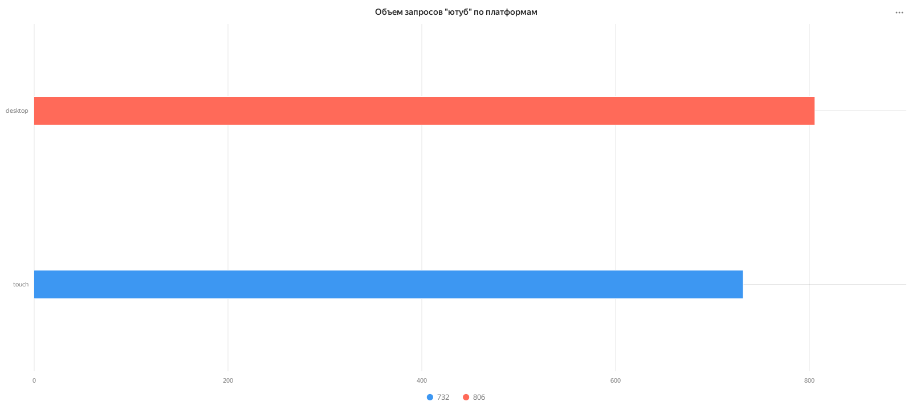
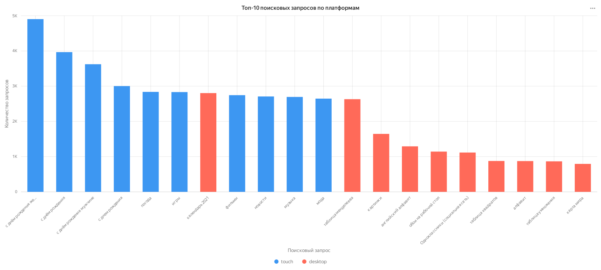
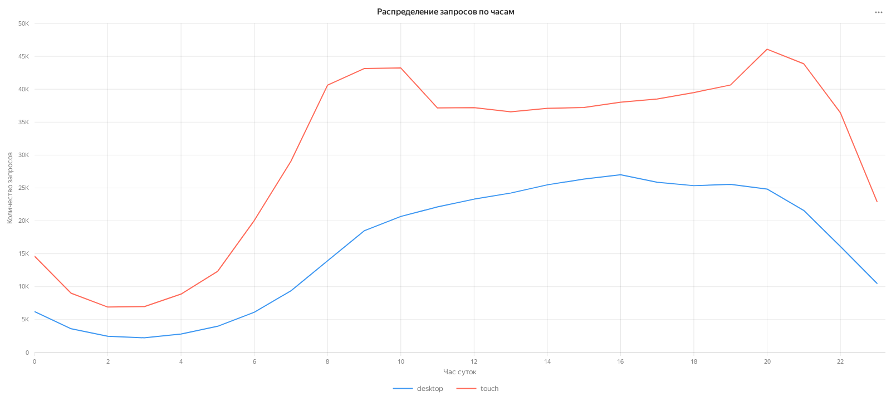
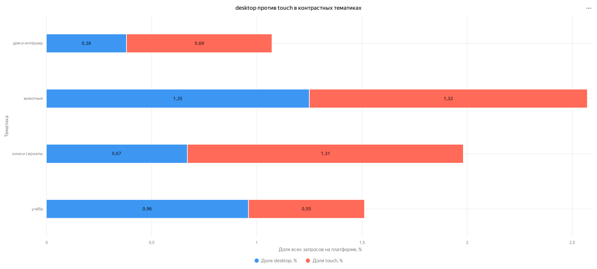

# Анализ поиска в Яндекс.Картинках

> Тестовое задание на позицию продуктового аналитика. SQL-анализ поведения пользователей поиска по картинкам на `desktop` и `touch`.

 

## Ситуация и задача

### Контекст

Поведение пользователей поиска может различаться в зависимости от устройства. Это влияет на то, какие сценарии и форматы выдачи стоит развивать для `desktop` и `touch`.

### Задача

Проверить гипотезу: **интересы пользователей поиска по картинкам на мобильных устройствах и компьютерах заметно отличаются**.

Для этого нужно было определить период данных, сравнить запрос «ютуб», изучить топ-10 запросов и суточный профиль, а затем выделить тематики с различающимися долями.

### Критерий успеха

Сформулировать воспроизводимый анализ и отделить наблюдаемые различия от продуктовых гипотез.

## Данные и подход

| Показатель | Значение |
| --- | ---: |
| Период | 1–21 сентября 2021 года |
| Поисковых событий | 1 114 365 |
| Доля `touch` | 65,16% |
| Доля `desktop` | 34,84% |

Я подготовил SQL-запросы в PostgreSQL, разделил абсолютные объёмы и относительные доли, а затем собрал итоговые таблицы и интерактивные графики в Yandex DataLens.

## Инсайты

### 1. Запрос «ютуб» сам по себе не объясняет разницу между платформами

В абсолютных значениях запрос встречался 806 раз на `desktop` и 732 раза на `touch`. При нормализации на объём трафика его доля выше на `desktop`: 0,208% против 0,101%.

[Открыть график в DataLens](https://datalens.yandex/phuqunclc9xc8)

### 2. У платформ различается контекст использования

В топе `desktop` преобладают учебные и справочные запросы: «календарь 2021», «таблица Менделеева», «английский алфавит». На `touch` — погода, поздравления, игры, фильмы, музыка и новости.

[Открыть график в DataLens](https://datalens.yandex/yq310ppjnnomh)

### 3. Суточные паттерны тоже различаются

Активность на `desktop` сильнее сосредоточена днём, с пиком в 16:00. На `touch` выделяются утренний и вечерний пики: 7:00–10:00 и 19:00–21:00.

[Открыть график в DataLens](https://datalens.yandex/jbomzhliz7us2)

### 4. Контрастные тематики подтверждают гипотезу на описательном уровне

| Тематика | `touch` | `desktop` | Интерпретация |
| --- | ---: | ---: | --- |
| Кино и сериалы | 1,31% | 0,67% | Мобильный поиск чаще связан с досугом |
| Дом и интерьер | 0,69% | 0,38% | Повседневные сценарии сильнее выражены на `touch` |
| Учёба | 0,55% | 0,96% | На `desktop` выше доля учебных задач |

[Открыть график в DataLens](https://datalens.yandex/h9ml6y7tger40)

## Продуктовые гипотезы

1. Для `touch` стоит проверять более быстрый доступ к повседневным и развлекательным сценариям: компактные блоки, продолжение недавнего поиска, адаптация выдачи под короткие сессии.
2. Для `desktop` стоит проверить более развёрнутую подачу справочной и учебной информации.
3. Перед внедрением нужны продуктовые эксперименты с метриками кликов, глубины поиска и удовлетворённости выдачей.

## Что получилось

Гипотеза поддержана на описательном уровне: топы запросов, доли тематик и суточные профили различаются между платформами. Результат анализа — не готовое решение, а обоснованный список гипотез для дальнейшей проверки.

## Артефакты

| Материал | Что внутри |
| --- | --- |
| [SQL-скрипт](analysis.sql) | Воспроизводимые PostgreSQL-запросы |
| [Excel с результатами](Результаты_анализа.xlsx) | Сводные таблицы и визуализации |
| [Общий обзор данных](00_Общий_обзор_данных.csv) | Период, объём и распределение трафика |
| [Визуализации и CSV](.) | Данные и графики для каждого этапа анализа |

## Навыки

`SQL` · `PostgreSQL` · `оконные функции` · `CTE` · `продуктовая аналитика` · `Yandex DataLens` · `визуализация` · `формирование гипотез`
